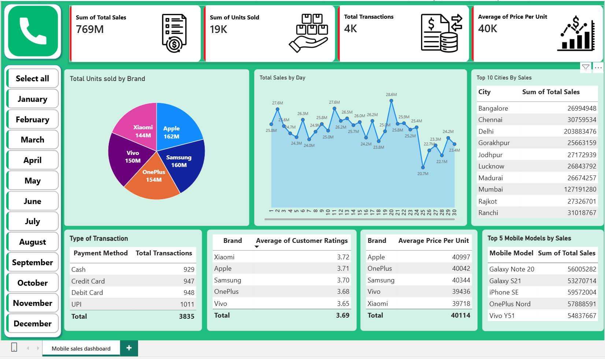

# 📱 Mobile Sales Dashboard — Power BI

## 📌 Project Overview

This project presents an interactive **Mobile Sales Dashboard** built using Microsoft Power BI.

The dashboard transforms mobile sales data into interactive business insights using **Power BI, DAX, Power Query, data modeling, and data visualization**.

This project is part of my analytics portfolio and demonstrates practical skills relevant to **Business Analyst, Data Analyst, and Business Intelligence roles**.

---

## 🎯 Project Objective

The objective of this project is to analyze mobile sales performance and provide an interactive view of the data.

The dashboard allows users to explore sales performance across different business dimensions using interactive filters, KPIs, and visualizations.

---

## 🛠️ Tools & Technologies

- Microsoft Power BI
- DAX
- Power Query
- Data Modeling
- Data Visualization
- Microsoft Excel

---

## 📊 Dashboard Features

The Power BI dashboard includes interactive analysis of mobile sales data, including:

- Sales KPIs
- Sales performance analysis
- Product and brand analysis
- Geographic analysis
- Customer-related analysis
- Payment and transaction analysis
- Interactive filters and slicers
- DAX-based calculations

---

## 🧮 DAX & Data Analysis

DAX was used to create calculated measures and support business analysis.

The project demonstrates the use of Power BI for:

- KPI calculations
- Aggregations
- Business metrics
- Comparative analysis
- Interactive filtering
- Data-driven reporting

---

## 🔄 Analysis Workflow

```text
Raw Excel Data
      ↓
Data Preparation
      ↓
Power Query
      ↓
Data Modeling
      ↓
DAX Measures
      ↓
Interactive Visualizations
      ↓
Mobile Sales Dashboard
```

---

## 🖼️ Dashboard Preview



---

## 📂 Project Files

```text
mobile-sales-dashboard-powerbi/
│
├── README.md
├── 1.Mobile Sales data.xlsx
├── 2.Mobile Sales Dashboard.pbix
└── 3.mobile_sales_dashboard.png
```

### Dataset

**`1.Mobile Sales data.xlsx`**

Source Excel dataset used for the Power BI analysis.

### Power BI Report

**`2.Mobile Sales Dashboard.pbix`**

Contains the Power BI report, data model, visualizations, and DAX calculations.

### Dashboard Screenshot

**`3.mobile_sales_dashboard.png`**

Static preview of the completed dashboard.

---

## 🎯 Skills Demonstrated

- Power BI dashboard development
- DAX
- Power Query
- Data modeling
- KPI development
- Interactive dashboard design
- Business data analysis
- Data visualization
- Excel data integration

---

## 📥 How to Use

1. Download `2.Mobile Sales Dashboard.pbix`.
2. Open it using **Microsoft Power BI Desktop**.
3. If Power BI asks for the source file, select `1.Mobile Sales data.xlsx`.
4. Refresh the data if required.
5. Explore the dashboard using the available filters and visualizations.

---

## 🚀 Project Outcome

This project demonstrates how raw sales data can be transformed into an interactive Power BI dashboard for business performance analysis and data-driven decision making.

It forms part of my portfolio focused on **Business Analytics, Supply Chain Analytics, Data Analytics, and Business Intelligence**.
